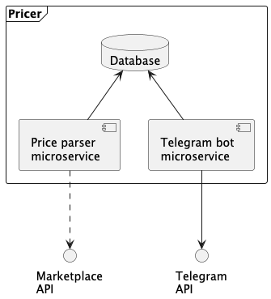

# Pricer system

Microservice system for parsing prices of marketplaces. 

There is marketplaces supported now:
- Wildberries

## System requirements

- Java 17
- Git
- Docker compose
- Maven

## Scheme of system



## How to install

1. Install all required applications
2. Register new Telegram bot
3. Set environment variables:
```bash
export DB_HOST=pricer-db
export DB_USER=postgres
export DB_PASSWORD=postgres
export TGBOT_PRICER_TOKEN=your_token
```
4. Clone repository
```bash
cd /opt
git clone --recurse-submodules https://github.com/sv-sand/pricer.git
```
5. Build all services and run it into docker-compose:
```bash
sh ./build.sh
```

## How to update new deploy

Pull updates from repository and build containers:
```bash
git pull
sh ./build.sh
```